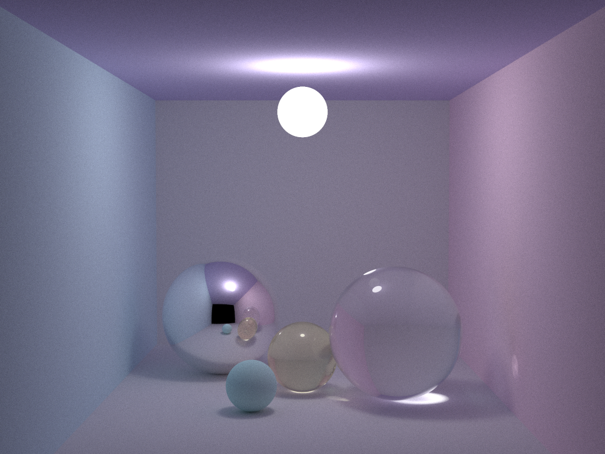
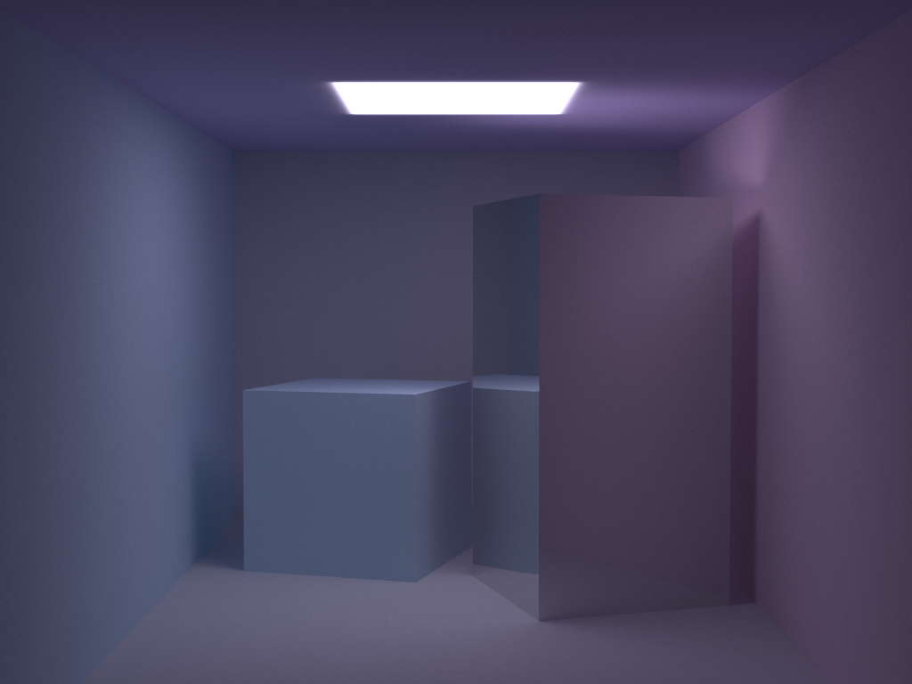

# TinyRenderer

无偏路径追踪算法，基于smallpt结构，支持球体和三角网格模型，支持光线反射、折射，支持Diffuse、Specular、Glass、Glossy四种材质。

编译：

```shell
g++ -o main main.cpp vec.cpp material.cpp object.cpp ray.cpp tracer.cpp -Wall -O3 -fopenmp
```

运行：

```shell
./main 10000 1
```

参数分别为spp和scene\_id范围为0-2


## 模型

Cornellbox和smallpt球体模型。object.cpp文件在读入空间点的下标从0开始，因此修改了.obj文件中的空间点下标，若需要生成正常.obj文件需要重新修改下标。


## 渲染结果

smallpt 球体模型




CornellBox 模型

